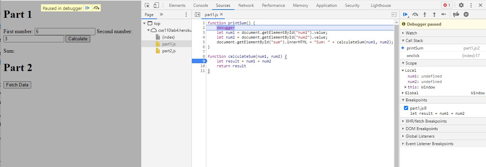
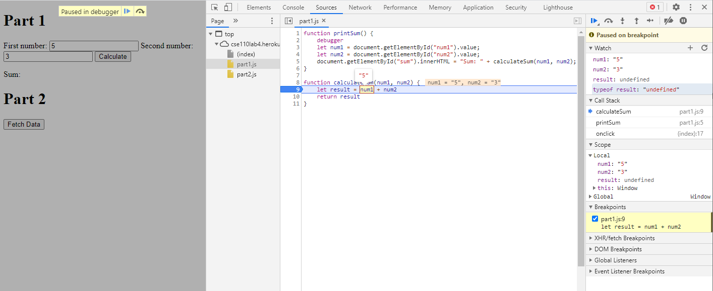
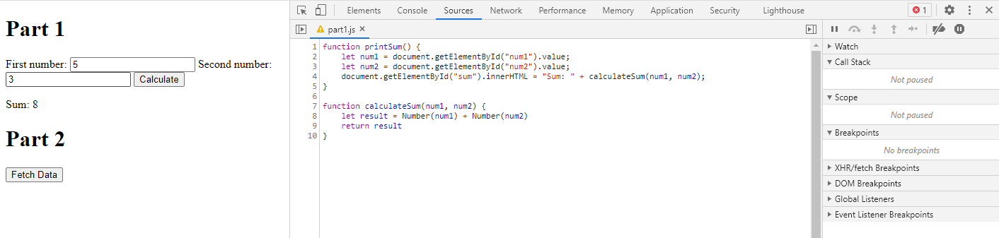

## Part 1: Devtools debugging

1. The bug was that the code was concatenating two string values together, rather than adding the integer values of the two numbers. 
2. I would fix this by converting the values to Number() before summing them. 

## Part 2: Network Tab
1. citylots.json
2. part2.js initiated the fetch request
3. 11.7 MB
4. 63 ms
5. Mozilla/5.0 (Windows NT 10.0; Win64; x64) AppleWebKit/537.36 (KHTML, like Gecko) Chrome/88.0.4324.104 Safari/537.36
6. Apache
7. Tue, 26 Jan 2021 22:14:13 GMT
8. application/json
9. fetchData() in part2.js
